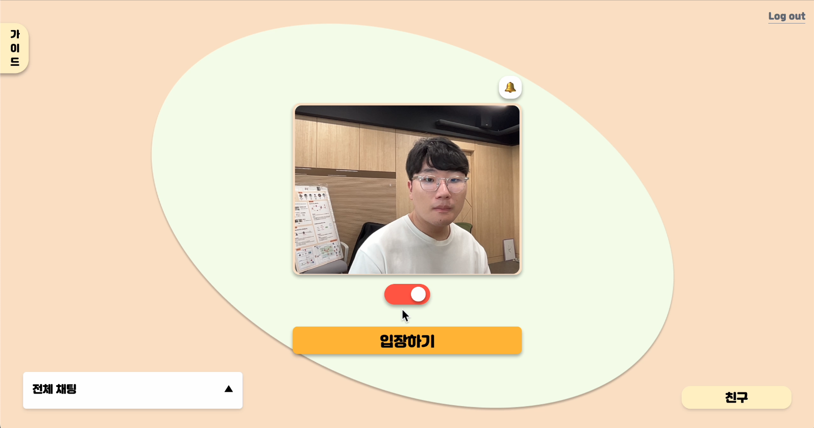
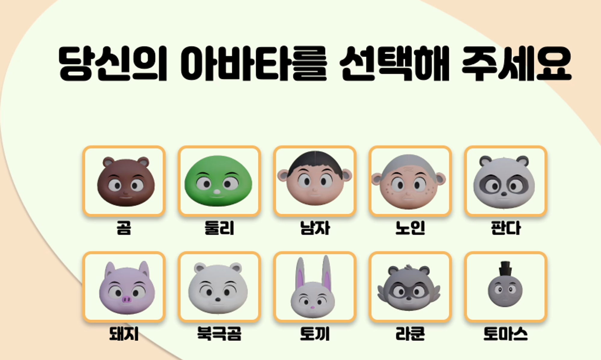
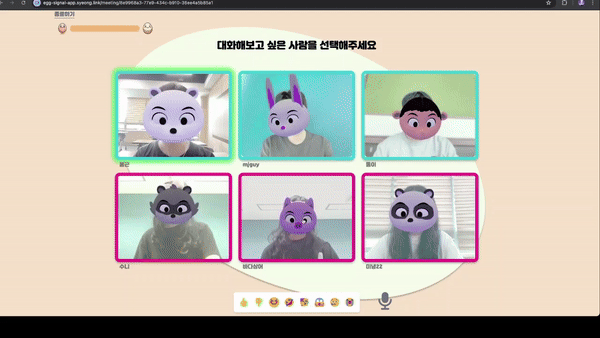
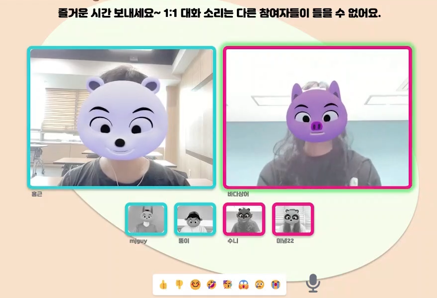
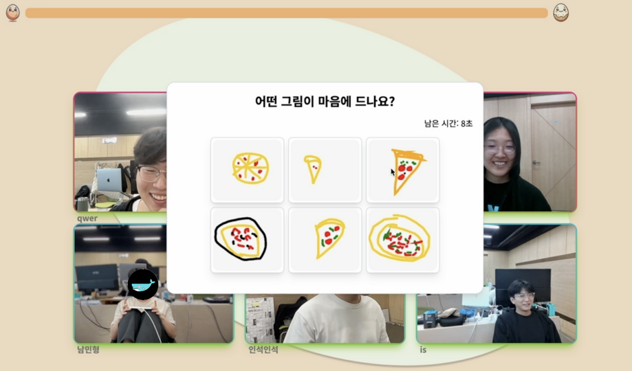
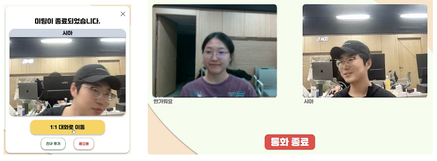
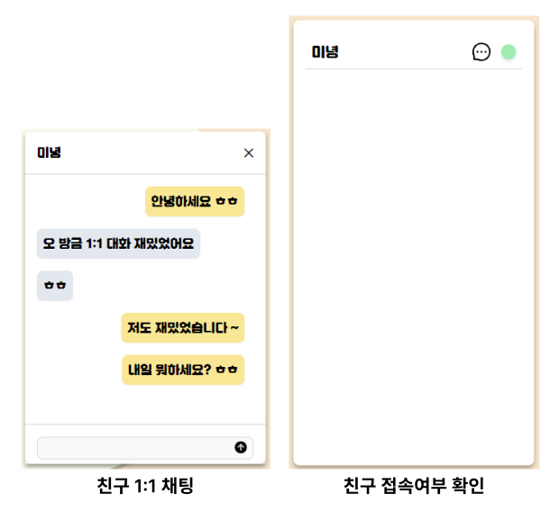

## 🍳 에그톡 (3대3 소셜 러브게임)

<div align="center"><b>에그톡은 첫 만남이 어색한 남/녀를 위한 3:3 단계별 소개팅 서비스 입니다.</b></div>
<br/>

## 💻 서비스 소개

### 서비스 화면

|                             메인 화면                             |                           아바타 선택                           |
| :---------------------------------------------------------------: | :-------------------------------------------------------------: |
|  |   |
|                          **로그인 화면**                          |                          **대시보드**                           |
|     |     |
|                       **미팅 중 1:1 대화**                        |                      **미팅 중 그림 대회**                      |
|     |  |
|                           **1:1 대화**                            |                          **친구 채팅**                          |
|   |     |

### 서비스 소개


#### 3대3 블라인드 미팅

미팅 중에 마음에 드는 사람과 1:1 대화를 할 수 있습니다.

#### 아이스브레이킹

처음 만나는 유저들간 어색함을 해소할 수 있는 자기 소개, 랜덤 질문, 그림 대회 이벤트를 제공합니다.

#### 최종 선택

최종 매칭이 되면 친구 신청 및 1:1 대화방으로 이동이 가능합니다. 친구가 되면 1:1 채팅을 할 수 있습니다.

## 팀원 구성

|        [남홍근](https://github.com/Amborsia)        |        [김성현](https://github.com/sh940701)        |        [김재원](https://github.com/won-N-only)        |        [박진용](https://github.com/Bambamsong)        |        [김인석](https://github.com/ingssg)        |        [이민형](https://github.com/hyeong1)        |
| :-------------------------------------------------: | :-------------------------------------------------: | :---------------------------------------------------: | :---------------------------------------------------: | :-----------------------------------------------: | :------------------------------------------------: |
|  |  |  |  |  |  |
|                      Back-End                       |                      Back-End                       |                       Back-End                        |                       Back-End                        |                     Front-End                     |                     Front-End                      |

## 🔨 기술 스택

### Front-End


### Back-End


## 📙 시작 가이드

🚨 node 버전 20 기준으로 개발하였습니다.

🚨 npm install 중 mind-ar canvas 오류가 생기면

```
brew install pkg-config cairo pango libpng jpeg giflib librsvg
```

위 명령어를 입력해주세요!

```
npm run dev
```

## 📰 포스터


